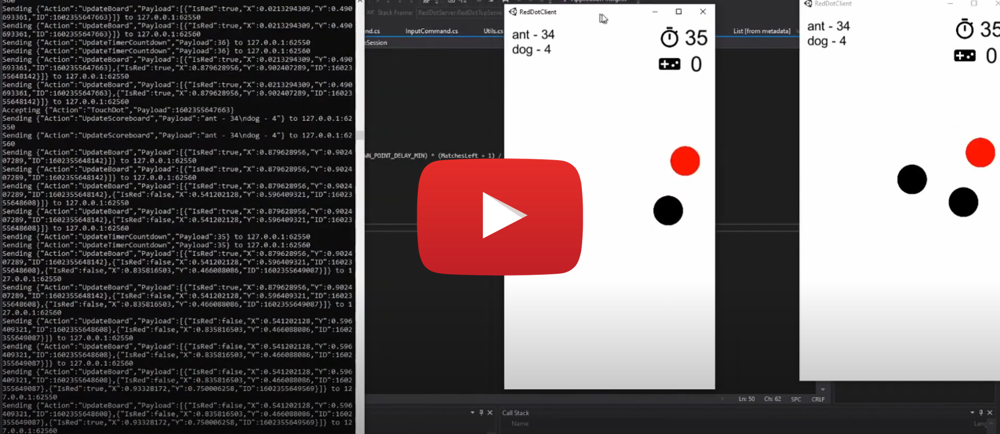
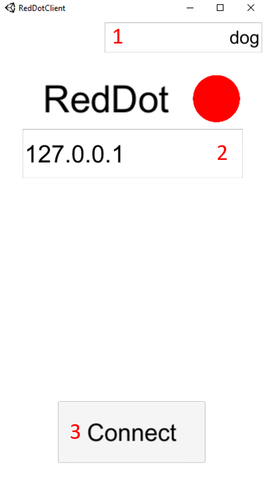
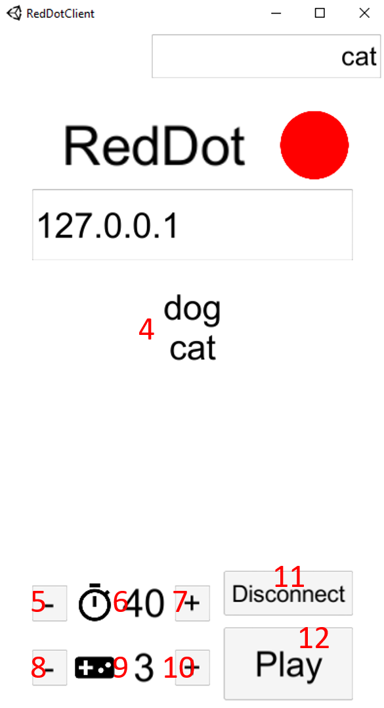
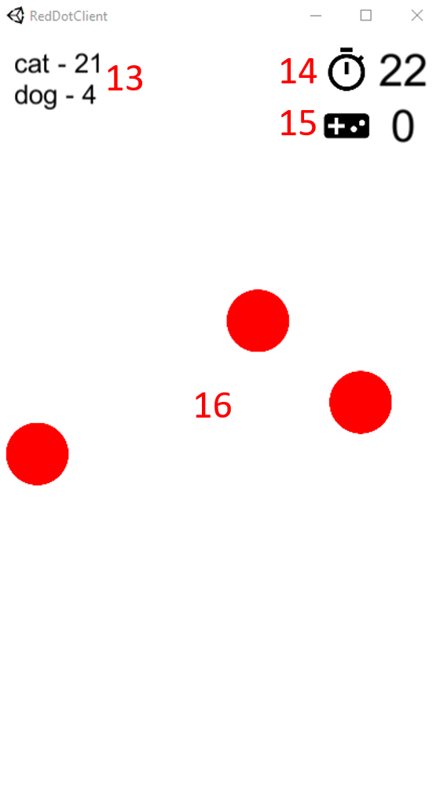
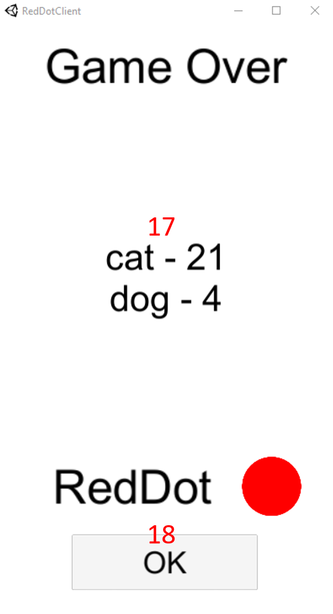

# RedDotTheGame

RedDot is a simple online game. You should collect more red dots than your friends.

Communication between client and server is implemented by sending json via tcp.

## Table of contents

- [About](#reddotthegame)
- [Demo](#demo)
- [Technologies](#technologies)
- [User interface](#user-interface)
- [Commands description](#commands-description)

## Demo

[](https://youtu.be/ouE86FlNc2k)

## Technologies

- Server - C# console app
- Client - Unity3d

## User interface

### `Connect to server` screen



1. Nickname input field. The nickname will be displayed in scoreboard
2. Field for server's ip address
3. Connect to server button. If server is not responding an error will be displayed

### `Game lobby` screen



4. List of players, connected to server
5. Button to decrease match duration by one second
6. Match duration
7. Button to increase match duration by one second
8. Button to decrease number of matches
9. Number of matches
10. Button to increase number of matches
11. Disconnect button. Disconnects from the server
12. Play button. Starts game

### `Game` screen



13. Scoreboard
14. Time left to end of the match
15. Number of matches remaining
16. Game field

### `Game over` screen



17. Scoreboard
18. OK button. Returns player to `Connect to server screen`

## Commands description

Communication between client and server is implemented by sending json via tcp.

```cs
  class Command
  {
    public string Action { get; set; }
    public object Payload { get; set; }
  }
```

### Commands that server sends to client

| Command              | Payload type  | Description                    |
| -------------------- | ------------- | ------------------------------ |
| RefreshRoomMembers   | string        | Updates list of room members   |
| UpdateMatchesCount   | int           | Updates number of matches      |
| UpdateMatchTime      | int           | Updates duration of the match  |
| OpenGame             | void          | Starts the game                |
| UpdateScoreboard     | string        | Updates scoreboard             |
| UpdateBoard          | Dot[] as json | Updates game field             |
| UpdateTimerCountdown | int           | Updates countdown timer        |
| UpdateGameCountdown  | int           | Updates game countdown counter |
| Gameover             | void          | Terminates the game            |

### Commands that client sends to server

| Command            | Payload type | Description                                                               |
| ------------------ | ------------ | ------------------------------------------------------------------------- |
| IncrementMatches   | int          | Requests server to increase number of matches. Payload can be negative    |
| IncrementMatchTime | int          | Requests server to increase duration of match. Payload can be negative    |
| StartGame          | void         | Requests server to start the game                                         |
| TouchDot           | long         | Informs server that dot has been touched by a player. Id sends by payload |
| Register           | string       | Adds player to session. Nickname sends by payload                         |
| Disconnect         | void         | Informs server that client will be disconnected                           |
